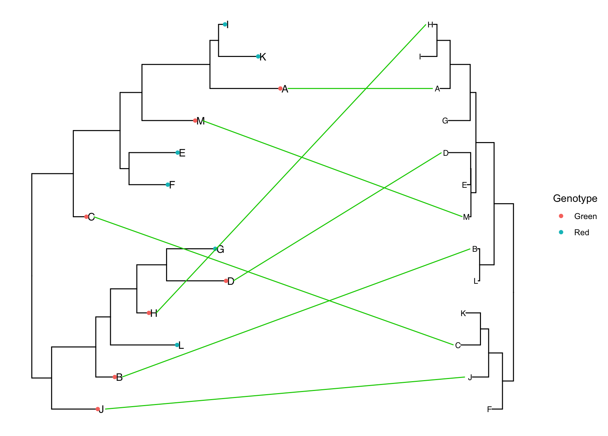
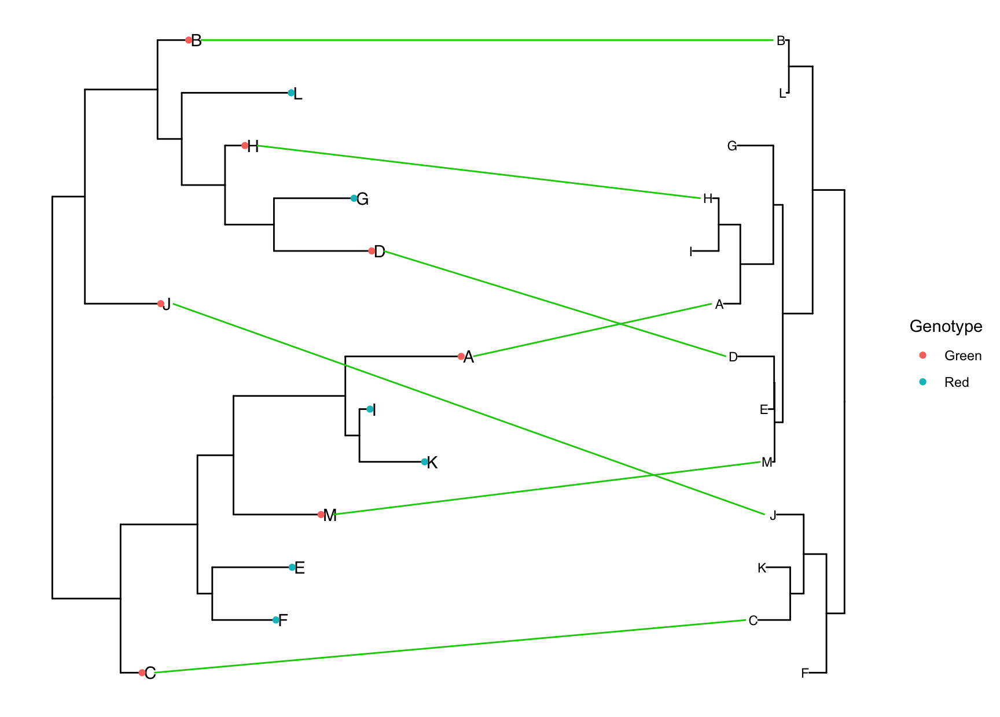
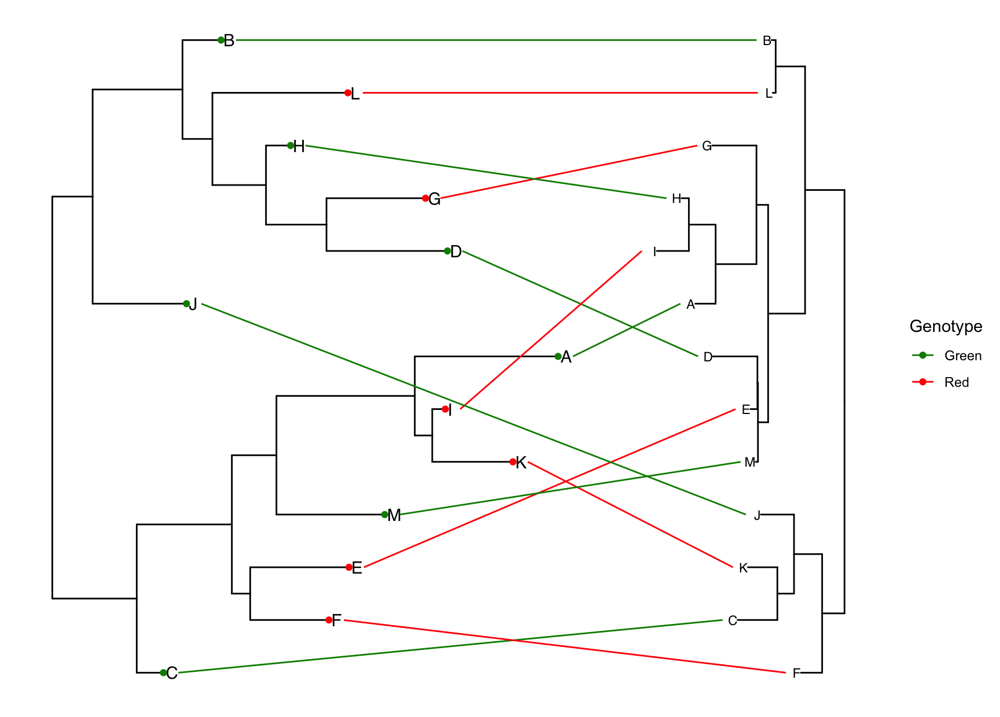

# TangleR
Tanglegram is a representation of co-phylogeny where two phylogenetic trees are linked. This package offers simple function to draw beautiful tanglegram. This is based on `ggtree`. You can annotate and illustrate the first ggtree object (main one), and then use a second ggtree to connect common tips based on any values shared by a defined column in their meta file.

## Background
I wrote a tutorial on how to create tanglegram on R in my website, which got some interest among peers: https://arftrhmn.net/how-to-make-cophylogeny/
Due to many comments, I decided to release my codes as a generic package in R.

## Install from GitHub
```
library("devtools")
install_github('acarafat/tangler')
```

## What it can do
- Draw tanglegram for a specific trait for a set of tips.
- Reorder both tree so that tips from both trees are ordered without changing overall tree-topology.
- Draw tanglegram for multiple traits for all tips.


## How to use it
```
library(ggtree)
library(tangler)
library(ggnewscale)
library(dplyr)
library(ggplot2)

# Load trees
t1 <- read.tree('data/tree1.nwk')
t2 <- read.tree('data/tree2.nwk')

# Load meta
meta=read.csv('tree_meta.csv', header=T) 

# Annotate trees
tree1 <- ggtree(t1)   %<+% meta +
  geom_tiplab() +
  geom_tippoint(aes(color=Genotype))


tree2 <- ggtree(t2) %<+% meta + geom_tiplab()

# Draw Tanglegram
simple.tanglegram(tree1, tree2, Genotype, Green, tiplab = T)

# Update the connecting line x-position so that it do not overlap with tip-labels.
simple.tanglegram(tree1, tree2, Genotype, Green, l_color = 'green3',  t2_pad = 0.3,
                  tiplab = T, lab_pad = 0.1, x_hjust = 1, t2_tiplab_size = 3)
```




Now let's say you want to reorder the tips of both phylogeny so that the tips are better aligned, however the overall tree toplogy is unchanged. For that you can use the `pre.rotate` function. The only difference is, you need to make sure that you are using `ladderize=FALSE` when converting the rotated tree in a ggtree object, otherwise ggtree will override tip-order. 

```
# Rotate the internal nodes so that tips of both trees are aligned
rotated_trees <- pre.rotate(t1, t2)

t1 <- rotated_trees[[1]]
t2 <- rotated_trees[[2]]

# Annotate Trees, make sure to set ladderize=F
tree1 <- ggtree(t1, ladderize=F)   %<+% meta +
  geom_tiplab() +
  geom_tippoint(aes(color=Genotype))

# Annotate Tree 2
tree2 <- ggtree(t2, ladderize=F) %<+% meta + geom_tiplab()


# Tanglegram, no line color
simple.tanglegram(tree1, tree2, Genotype, l_color = 'green3', Green, t2_pad = 0.3,
                           tiplab = T, lab_pad = 0.1, x_hjust = 1, t2_tiplab_size = 3)
```



You can also draw tanglegram for all traits in the column using `common.tanglegram` function.

```
common.tanglegram(tree1, tree2, column = 'Genotype', sampletypecolors = c('green4', 'red'), t2_pad = 0.3,
                           tiplab = T, lab_pad = 0.1, t2_tiplab_size = 3)
```


## Feature Request and Bug Reports
Please use this GitHub repo's `Issues` :) 
