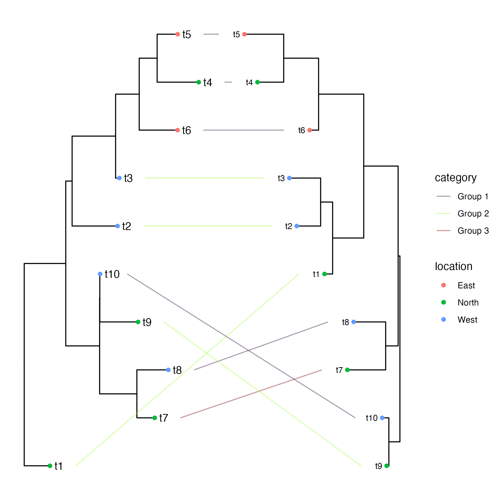
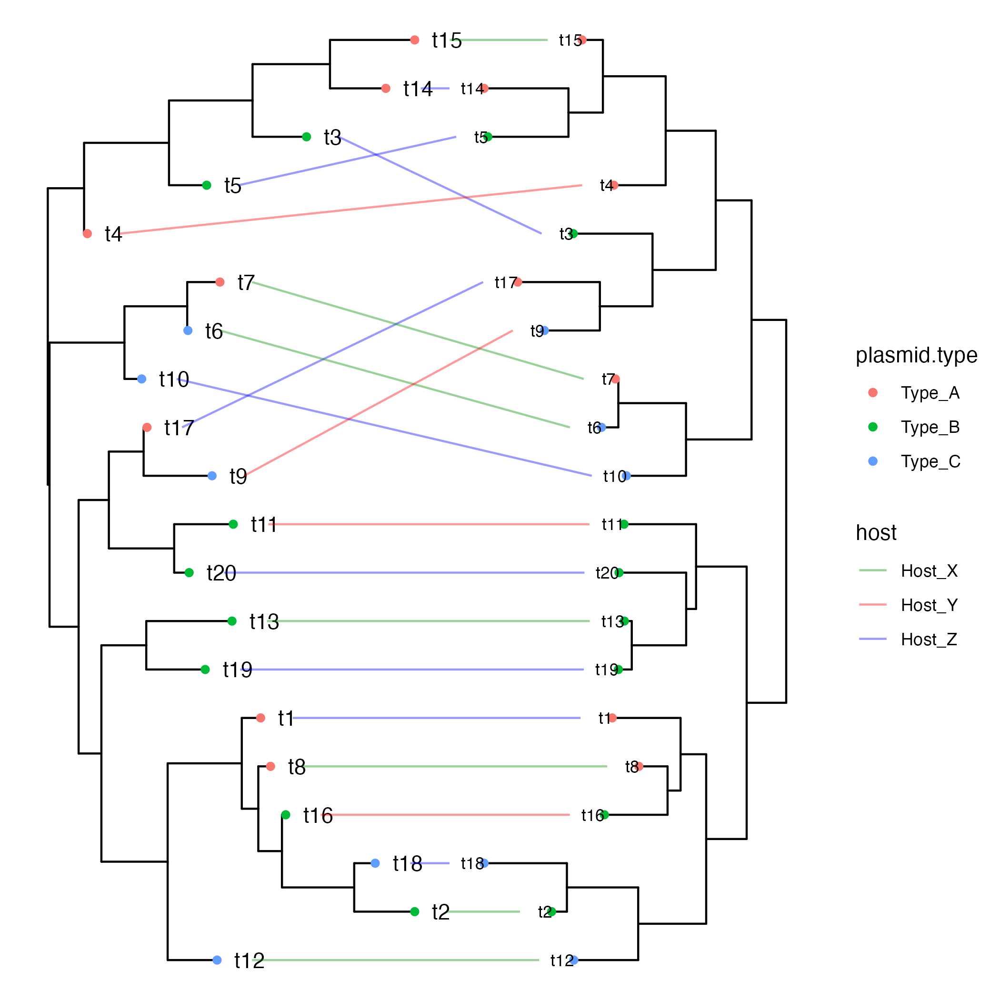

# TangleR

A tanglegram is a representation of co-phylogeny where phylogenetic trees are linked by matching tips. This R package offers simple functions to draw beautiful, publication-ready tanglegrams based on `ggtree`. 

You can annotate and illustrate the trees using standard `ggtree` code, and then connect shared tips based on any metadata column. 

With `tangler` you can:
- Draw tanglegrams connecting a subset of tips based on a specific trait value (`simple.tanglegram`).
- Draw tanglegrams connecting all tips, colored by a categorical metadata column (`common.tanglegram`).
- Draw tripartite association tanglegrams featuring three trees simultaneously (`triple.tanglegram`).
- Automatically reorder (rotate) branches to minimize line crossings without mutating tree topology (`pre.rotate`).

---

## Installation

### Prerequisites (from Bioconductor)
Before installing, ensure you have the required Bioconductor and CRAN packages:

```R
if (!requireNamespace("BiocManager", quietly = TRUE))
    install.packages("BiocManager")

BiocManager::install(c("ggtree", "phytools", "ggnewscale"))
install.packages(c("ggplot2", "dplyr", "viridis"))
```

### Install tangler from GitHub
Use `devtools` to build and install the package:

```R
if (!requireNamespace("devtools", quietly = TRUE))
    install.packages("devtools")

devtools::install_github("acarafat/tangler")
```

---

## How to Use It

To get started, you will need two or three phylogenetic trees as `phylo` objects (which share tip labels, at least partially) and a metadata `data.frame` mapping tip labels to their respective traits or categorizations.

Here is how you can generate dummy trees and metadata to test the package:

```R
library(ggplot2)
library(ggtree)
library(dplyr)
library(tangler)

# 1. Create dummy trees
set.seed(42)
library(ape)
t1 <- rtree(10)
t2 <- rtree(10)

t1$tip.label <- paste0("t", 1:10)
t2$tip.label <- paste0("t", 1:10)

# 2. Create metadata with categorical and tip-coloring columns
meta <- data.frame(
  label = paste0("t", 1:10),
  category = sample(c("Group 1", "Group 2", "Group 3"), 10, replace = TRUE),
  location = sample(c("North", "South", "East", "West"), 10, replace = TRUE)
)

# 3. Convert to annotated ggtree objects
tree1_unrot <- ggtree(t1) %<+% meta
tree2_unrot <- ggtree(t2) %<+% meta

tree1_unrot_labeled <- tree1_unrot + geom_tiplab(aes(x = x + 0.1))
```

### Drawing a Tanglegram (Before Rotation)

Without `pre.rotate`, you often get many crossed lines:

```R
# Draw tanglegram coloring connecting lines by 'category'
common.tanglegram(
  tree1_unrot_labeled, tree2_unrot, 
  column = "category", 
  tip_column = "location",
  tiplab = TRUE, 
  t2_pad = 1, 
  lab_pad = 0.5, 
  t2_tiplab_pad = 0.1
)
```



### Untangling with pre.rotate

To minimize crossed vertical lines, rotate the internal nodes *before* building the `ggtree` objects.

```R
# 1. Pre-align Tip Orders
rotated_trees <- pre.rotate(t1, t2)
rot_t1 <- rotated_trees[[1]]
rot_t2 <- rotated_trees[[2]]

# 2. Convert to annotated ggtree objects
# Note: Make sure to set ladderize = FALSE so ggtree respects the rotation layout
rot_tree1 <- ggtree(rot_t1, ladderize = FALSE) %<+% meta
rot_tree2 <- ggtree(rot_t2, ladderize = FALSE) %<+% meta

rot_tree1_labeled <- rot_tree1 + geom_tiplab(aes(x = x + 0.1))

# 3. Draw the tanglegram with rotated trees
common.tanglegram(
  rot_tree1_labeled, rot_tree2, 
  column = "category", 
  tip_column = "location",
  tiplab = TRUE, 
  t2_pad = 1, 
  lab_pad = 0.5, 
  t2_tiplab_pad = 0.1
)
```



> **Note:** For more advanced examples including filtering by specific traits (`simple.tanglegram`), tripartite tanglegrams featuring three trees (`triple.tanglegram`), and more, please refer to the package vignette (`vignette("tangler-vignette")`).

---

## Feature Requests & Bug Reports
For questions, enhancements, or bug reports, please open an issue in this repository's **Issues** tracker!
