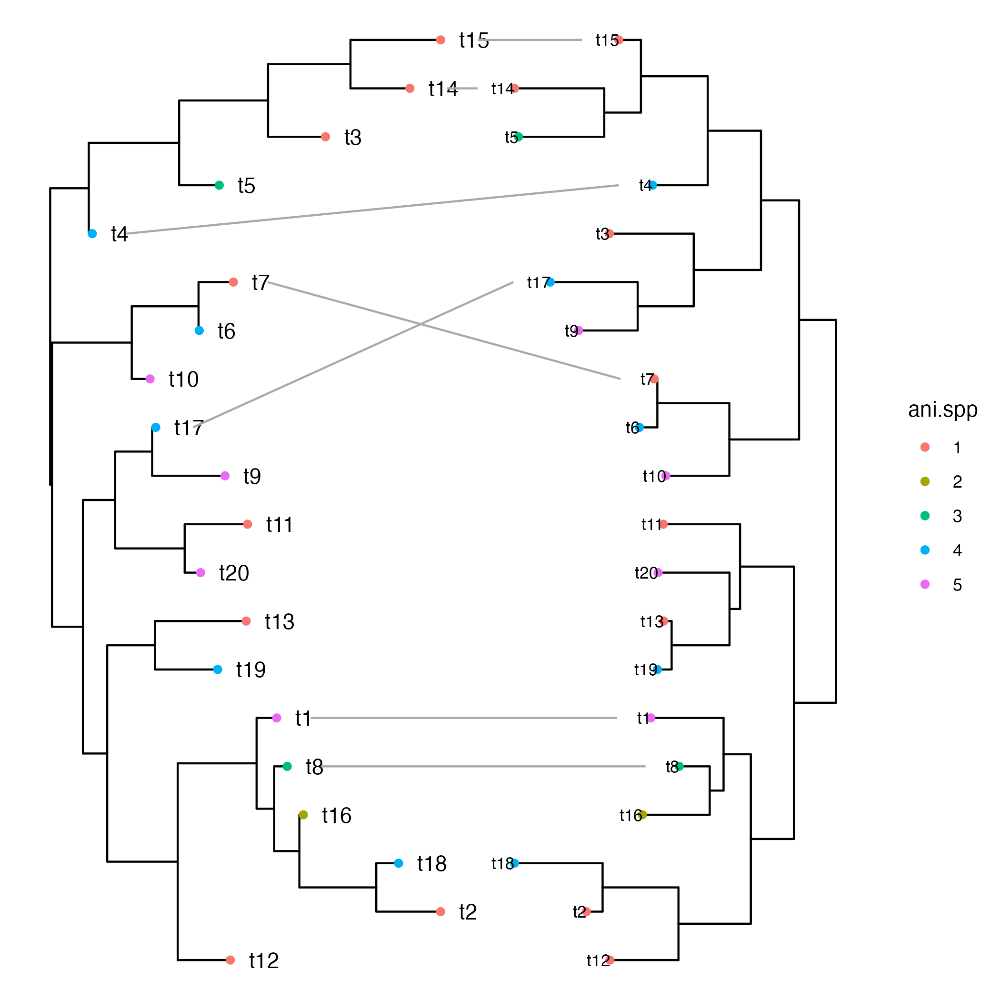
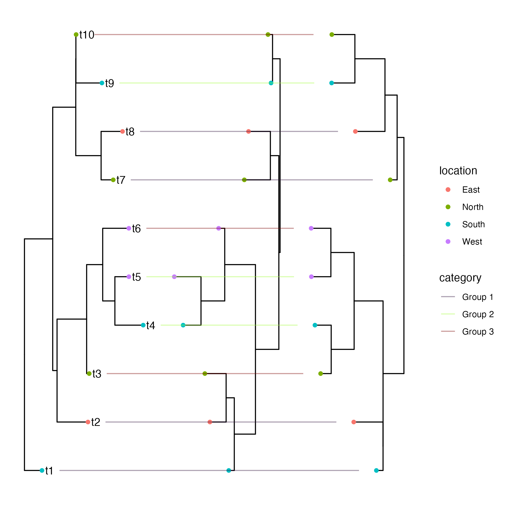

# TangleR

A tanglegram is a representation of co-phylogeny where phylogenetic trees are linked by matching tips. This R package offers simple functions to draw beautiful, publication-ready tanglegrams based on `ggtree`. 

You can annotate and illustrate the trees using standard `ggtree` code, and then connect shared tips based on any metadata column. 

With `tangler` you can:
- Draw tanglegrams connecting a subset of tips based on a specific trait value (`simple.tanglegram`).
- Draw tanglegrams connecting all tips, colored by a categorical metadata column (`common.tanglegram`).
- Draw tripartite association tanglegrams featuring three trees simultaneously (`triple.tanglegram`).
- Automatically reorder (rotate) branches to minimize line crossings without mutating tree topology (`pre.rotate`).

---

## Installation

### Prerequisites (from Bioconductor)
Before installing, ensure you have the required Bioconductor and CRAN packages:

```R
if (!requireNamespace("BiocManager", quietly = TRUE))
    install.packages("BiocManager")

BiocManager::install(c("ggtree", "phytools", "ggnewscale"))
install.packages(c("ggplot2", "dplyr", "viridis"))
```

### Install tangler from GitHub
Use `devtools` to build and install the package:

```R
if (!requireNamespace("devtools", quietly = TRUE))
    install.packages("devtools")

devtools::install_github("acarafat/tangler")
```

---

## How to Use It

To get started, you will need two or three phylogenetic trees as `phylo` objects (which share tip labels, at least partially) and a metadata `data.frame` mapping tip labels to their respective traits or categorizations.

Here is how you can generate dummy trees and metadata to test the package:

```R
library(ggplot2)
library(ggtree)
library(dplyr)
library(tangler)

# 1. Create dummy trees
set.seed(42)
t1 <- phangorn::midpoint(ape::rtree(20))
t2 <- phangorn::midpoint(ape::rtree(20))
t3 <- phangorn::midpoint(ape::rtree(20))

# Ensure the tip labels match across all trees
t2$tip.label <- t1$tip.label
t3$tip.label <- t1$tip.label

# 2. Create metadata with categorical and tip-coloring columns
meta <- data.frame(
  label = t1$tip.label,
  host = sample(c("Host_X", "Host_Y", "Host_Z"), 20, replace = TRUE),
  plasmid.type = sample(c("Type_A", "Type_B", "Type_C"), 20, replace = TRUE),
  ani.spp = as.character(sample(1:5, 20, replace = TRUE))
)

# 3. Pre-align Tip Orders (Untangling)
# To minimize crossed vertical lines, rotate the internal nodes before building the ggtree objects.
rotated_trees <- pre.rotate(t1, t2)
t1 <- rotated_trees[[1]]
t2 <- rotated_trees[[2]]

# 4. Convert to annotated ggtree objects
# Note: Make sure to set ladderize = FALSE so ggtree respects the rotation layout
tree1 <- ggtree(t1, ladderize = FALSE) %<+% meta + geom_tiplab(aes(x = x + 0.2))
tree2 <- ggtree(t2, ladderize = FALSE) %<+% meta + geom_tiplab(aes(x = x - 0.2))
tree3 <- ggtree(t3, ladderize = FALSE) %<+% meta + geom_tiplab(aes(x = x - 0.2))
```

### 1. Drawing a Tanglegram for a Specific Trait
If you only want to highlight lines connecting tips matching one specific trait value, use `simple.tanglegram`:

```R
# Draw tanglegram highlighting the 'Type_A' plasmid type
simple.tanglegram(tree1, tree2, column = plasmid.type, value = "Type_A", tip_column = ani.spp,
                  t2_pad = 0.8, tiplab = TRUE, lab_pad = 0.3, x_hjust = 1, t2_tiplab_size = 3)
```



---

### 2. Coloring Lines by Categorical Groups
If you want to view links for all tips, colored dynamically by their category, use `common.tanglegram`:

```R
# Draw tanglegram coloring connecting lines by 'host' category
common.tanglegram(tree1, tree2, column = "host", tip_column = "plasmid.type",
                  sampletypecolors = c("Host_X" = "green4", "Host_Y" = "red", "Host_Z" = "blue"),
                  t2_pad = 0.8, tiplab = TRUE, lab_pad = 0.3, t2_tiplab_size = 3)
```


---

### 3. Tripartite Tanglegrams (`triple.tanglegram`)
For visualizing tripartite relations spanning three trees (e.g., Tree 1 <-> Tree 2 <-> Tree 3), use `triple.tanglegram`:

```R
# Render Triple Tanglegram
triple.tanglegram(tree1, tree2, tree3, column = "host", tip_column = "ani.spp",
                  sampletypecolors = c("Host_X" = "green4", "Host_Y" = "red", "Host_Z" = "blue"),
                  t2_pad = 0.8, t3_pad = 0.8, lab_pad = 0.3)
```



---

## Feature Requests & Bug Reports
For questions, enhancements, or bug reports, please open an issue in this repository's **Issues** tracker!
