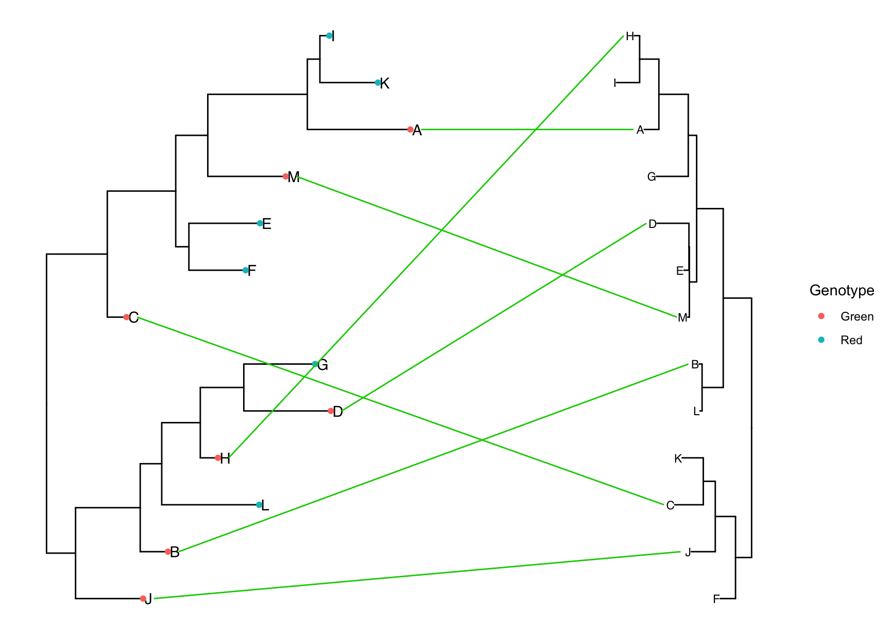
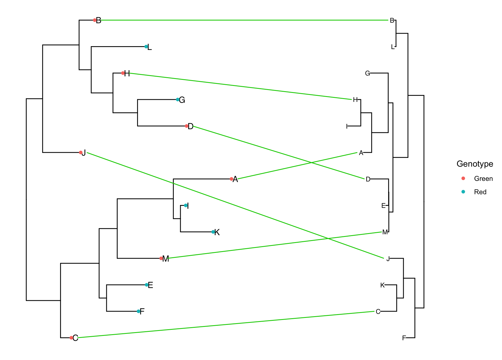
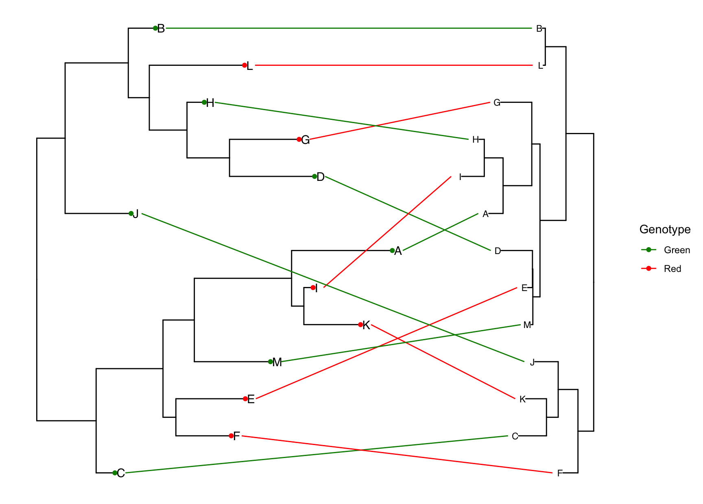

# TangleR

A tanglegram is a representation of co-phylogeny where phylogenetic trees are linked by matching tips. This R package offers simple functions to draw beautiful, publication-ready tanglegrams based on `ggtree`. 

You can annotate and illustrate the trees using standard `ggtree` code, and then connect shared tips based on any metadata column. 

With `tangler` you can:
- Draw tanglegrams connecting a subset of tips based on a specific trait value (`simple.tanglegram`).
- Draw tanglegrams connecting all tips, colored by a categorical metadata column (`common.tanglegram`).
- Draw tripartite association tanglegrams featuring three trees simultaneously (`triple.tanglegram`).
- Automatically reorder (rotate) branches to minimize line crossings without mutating tree topology (`pre.rotate`).

---

## Installation

### Prerequisites (from Bioconductor)
Before installing, ensure you have the required Bioconductor and CRAN packages:

```R
if (!requireNamespace("BiocManager", quietly = TRUE))
    install.packages("BiocManager")

BiocManager::install(c("ggtree", "phytools", "ggnewscale"))
install.packages(c("ggplot2", "dplyr", "viridis"))
```

### Install tangler from GitHub
Use `devtools` to build and install the package:

```R
if (!requireNamespace("devtools", quietly = TRUE))
    install.packages("devtools")

devtools::install_github("acarafat/tangler")
```

---

## How to Use It

To get started, you will need two or three phylogenetic trees as `phylo` objects (which share tip labels, at least partially) and a metadata `data.frame` mapping tip labels (typically in a `label` folder or column) to the categorizations.

Here is an example metadata file format:

| label | Genotype |
| :--- | :--- |
| A | Green |
| B | Green |
| C | Green |
| D | Green |
| E | Red |
| F | Red |

### 1. Drawing a Tanglegram for a Specific Trait
If you only want to highlight lines connecting tips matching one specific trait value, use `simple.tanglegram`:

```R
library(ggplot2)
library(ggtree)
library(dplyr)
library(tangler)

# Load trees and metadata
t1 <- ape::read.tree('data/tree1.nwk')
t2 <- ape::read.tree('data/tree2.nwk')
meta <- read.csv('tree_meta.csv', header = TRUE) 

# Convert to annotated ggtree objects
tree1 <- ggtree(t1) %<+% meta +
  geom_tiplab() +
  geom_tippoint(aes(color = Genotype))

tree2 <- ggtree(t2) %<+% meta + geom_tiplab()

# Draw tanglegram highlighting the 'Green' genotype
simple.tanglegram(tree1, tree2, column = Genotype, value = Green, 
                  l_color = 'green3', t2_pad = 0.5, tiplab = TRUE, 
                  lab_pad = 0.05, x_hjust = 1, t2_tiplab_size = 3)
```



---

### 2. Pre-aligning Tip Orders (Untangling)
To minimize crossed vertical lines, you can rotate the internal nodes using the `pre.rotate` helper function before drawing. Note: **Make sure to set `ladderize = FALSE`** when constructing the `ggtree` objects, so `ggtree` respects the updated rotation layout.

```R
# Optimize/align the tip layouts of both trees
rotated_trees <- pre.rotate(t1, t2)
t1_rotated <- rotated_trees[[1]]
t2_rotated <- rotated_trees[[2]]

# Build ggtree representation with ladderize = FALSE
tree1 <- ggtree(t1_rotated, ladderize = FALSE) %<+% meta +
  geom_tiplab() +
  geom_tippoint(aes(color = Genotype))

tree2 <- ggtree(t2_rotated, ladderize = FALSE) %<+% meta + geom_tiplab()

# Render tanglegram
simple.tanglegram(tree1, tree2, column = Genotype, value = Green, 
                  l_color = 'green3', t2_pad = 0.5, tiplab = TRUE, 
                  lab_pad = 0.05, x_hjust = 1, t2_tiplab_size = 3)
```



---

### 3. Coloring Lines by Categorical Groups
If you want to view links for all tips, colored dynamically by their category, use `common.tanglegram`:

```R
common.tanglegram(tree1, tree2, column = 'Genotype', 
                  sampletypecolors = c('Green' = 'green4', 'Red' = 'red'), 
                  t2_pad = 0.5, tiplab = TRUE, lab_pad = 0.05, t2_tiplab_size = 3)
```



---

### 4. Tripartite Tanglegrams (`triple.tanglegram`)
For visualizing tripartite relations (e.g., Tree 1 <-> Tree 2 <-> Tree 3), use `triple.tanglegram`:

```R
# Load third tree
t3 <- ape::read.tree('data/tree3.nwk')
tree3 <- ggtree(t3, ladderize = FALSE) %<+% meta

# Render Triple Tanglegram
triple.tanglegram(tree1, tree2, tree3, column = 'Genotype',
                  t2_pad = 0.5, t3_pad = 0.5,
                  lab_pad = 0.05)
```

---

## Feature Requests & Bug Reports
For questions, enhancements, or bug reports, please open an issue in this repository's **Issues** tracker!
