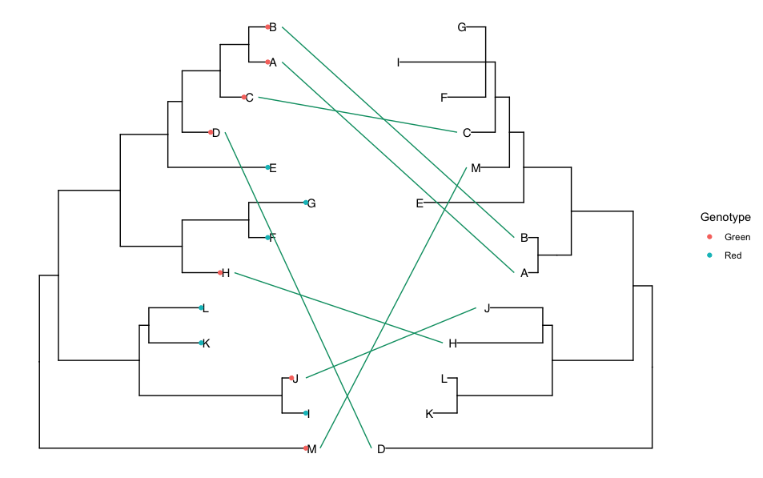

# TangleR
Tanglegram is a representation of co-phylogeny where two phylogenetic trees are linked. This package offers simple function to draw beautiful tanglegram. This is based on `ggtree`. You can annotate and illustrate the first ggtree object (main one), and then use a second ggtree to connect common tips based on any values shared by a defined column in their meta file.

## Background
I wrote a tutorial on how to create tanglegram on R in my website, which got some interest among peers: https://arftrhmn.net/how-to-make-cophylogeny/
Due to many comments, I decided to release my codes as a generic package in R.

## Install from GitHub
```
library("devtools")
install_github('acarafat/tangler')
```

## Use it
```
library(ggtree)

# Load meta
meta=read.csv('tree_meta.csv', header=T) 

# Load tree 1
t1 <- read.tree('tree1.nwk')

# Load tree 1 and use ggtree to annotate features
tree1 <- ggtree(t1)   %<+% meta +
  geom_tiplab() +
  geom_tippoint(aes(color=Genotype))

# Load tree 2
t2 <- read.tree("tree2.nwk")
tree2 <- ggtree(t2) %<+% meta

# Draw Tanglegram
simple.tanglegram(tree1, tree2, Genotype, Green, tiplab = T)

# Update the connecting line x-position so that it do not overlap with tip-labels.
simple.tanglegram(tree1, tree2, Genotype, Green,
                  tiplab = T, lab_pad = 3, x_hjust = 1)
```

Now you can update the x-position of the lines' beginning and ending by `lab_pad`, which will introduce equidistant padding. `t2_tiplab_size` has been introduced to control Tree 2 tip labels. 

```
simple.tanglegram(t1, t2, sample_type, clinical, t2_pad = 0.5,
                           tiplab = T, lab_pad = 0, x_hjust = 1, 
                           t2_y_pos = 0, t2_y_scale = 1.5, t2_branch_scale = 0.3)
```
# Output


## Feature Request and Bug Reports
Please use this GitHub repo's `Issues` :) 
